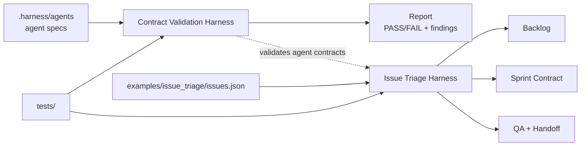
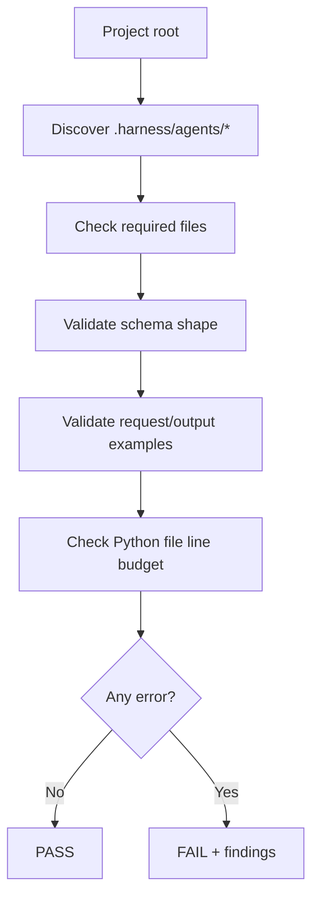
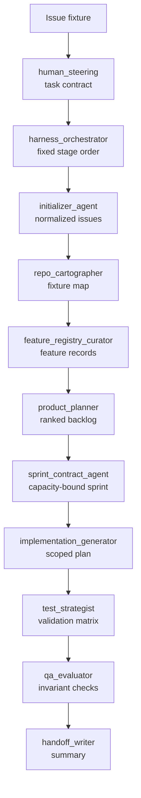

# My Harness Workflow

**Language:** English | [中文](README.zh-CN.md)

This is a contract-driven agent harness workspace. It currently includes two executable harnesses:

- Contract Validation Harness: validates `.harness/agents/*` contracts, schemas, examples, and code line budgets.
- Issue Triage Harness: runs a full 11-agent issue triage, sprint planning, QA, and handoff workflow from an offline GitHub-like fixture.

The design is intentionally compact: split agent work into verifiable contracts, explicit state, reproducible inputs, machine-checkable outputs, and end-to-end tests. Runtime code has no third-party dependency, and the self-check enforces a 300-line budget for Python code files.

## Quick Start

```powershell
python -m harness .
python -m harness . --json
python -m harness issue-triage examples\issue_triage\issues.json --capacity 13
python -m unittest discover -s tests -v
```

## Architecture



## Existing Agents

| Agent | Role |
| --- | --- |
| `human_steering` | Captures goals, constraints, approvals, risks, and stop conditions. |
| `harness_orchestrator` | Routes the workflow, enforces phase order, and blocks unsafe progress. |
| `initializer_agent` | Initializes or normalizes task input into a stable working shape. |
| `repo_cartographer` | Maps the repository or fixture source so later stages know what exists. |
| `product_planner` | Converts inputs into prioritized product/backlog decisions. |
| `sprint_contract_agent` | Creates bounded sprint contracts with acceptance criteria and capacity. |
| `implementation_generator` | Produces scoped implementation plans or change records. |
| `qa_evaluator` | Independently checks acceptance criteria, validation results, and risks. |
| `handoff_writer` | Produces handoff summaries and next-step records. |
| `feature_registry_curator` | Maintains stable feature records and duplicate/status reconciliation. |
| `test_strategist` | Plans validation commands, coverage, and regression strategy. |

## Harness Architectures

Each harness is intentionally small, explicit, and testable. The sections below show the boundary, entrypoint, files, agent coverage, and execution flow for each architecture.

---

## Harness Architecture 01 - Contract Validation Harness

**Detailed README:** [harness/README.md](harness/README.md)

**Purpose:** validate the control-plane contracts that define the available agents.

**Entrypoint:**

```powershell
python -m harness .
python -m harness . --json
```

**At a glance:**

| Aspect | Design |
| --- | --- |
| Input | `.harness/agents/*` contract directories |
| Output | `PASS/FAIL` report with structured findings |
| Scope | Agent specs, JSON schemas, examples, interface shape, Python line budget |
| Runtime dependency | Python standard library only |
| Failure mode | Non-zero exit code when any error-level finding exists |

**Core files:**

| File | Purpose |
| --- | --- |
| [harness/core.py](harness/core.py) | Discovers agents, validates required files, checks JSON schemas/examples, and enforces Python line budget. |
| [harness/__main__.py](harness/__main__.py) | CLI entrypoint for contract validation and issue triage. |
| [harness/__init__.py](harness/__init__.py) | Public Python API exports. |
| [tests/test_harness.py](tests/test_harness.py) | Regression tests for schema validation, agent checks, CLI JSON, and line-budget enforcement. |

**Agents used:**

- Discovers and validates every agent under `.harness/agents/*`.
- It does not execute agent behavior; it verifies contracts, schemas, examples, and support files.

**Architecture flow:**



---

## Harness Architecture 02 - Issue Triage Harness

**Detailed README:** [examples/issue_triage/README.md](examples/issue_triage/README.md)

**Purpose:** run a realistic but compact GitHub issue triage workflow from offline fixture data.

**Entrypoint:**

```powershell
python -m harness issue-triage examples\issue_triage\issues.json --capacity 13
python -m harness issue-triage examples\issue_triage\issues.json --capacity 13 --json
```

**At a glance:**

| Aspect | Design |
| --- | --- |
| Input | Offline GitHub-like issue/PR JSON fixture |
| Output | Backlog, related groups, sprint contract, test strategy, QA, handoff |
| Scope | Full 11-agent workflow from steering to handoff |
| Runtime dependency | Python standard library only |
| Failure mode | Non-zero exit code when QA invariants fail |

**Core files:**

| File | Purpose |
| --- | --- |
| [harness/issue_triage.py](harness/issue_triage.py) | Normalizes issues, detects related issues, ranks backlog, packs sprint capacity, creates QA and handoff output. |
| [examples/issue_triage/issues.json](examples/issue_triage/issues.json) | Offline GitHub-like issue/PR fixture. |
| [examples/issue_triage/README.md](examples/issue_triage/README.md) | Detailed guide for the issue triage harness. |
| [tests/test_issue_triage.py](tests/test_issue_triage.py) | End-to-end tests for all-agent execution, scoring, duplicate detection, capacity, CLI JSON, and invalid input. |

**Agents used:**

1. `human_steering`
2. `harness_orchestrator`
3. `initializer_agent`
4. `repo_cartographer`
5. `feature_registry_curator`
6. `product_planner`
7. `sprint_contract_agent`
8. `implementation_generator`
9. `test_strategist`
10. `qa_evaluator`
11. `handoff_writer`

**Architecture flow:**



---

## Quality Gates

The current verification chain is:

```powershell
python -m unittest discover -s tests -v
python -m harness .
python -m harness issue-triage examples\issue_triage\issues.json --capacity 13
python -m py_compile harness\__init__.py harness\__main__.py harness\core.py harness\issue_triage.py tests\test_harness.py tests\test_issue_triage.py
```

Expected results:

- 15 tests pass.
- `python -m harness .` returns `PASS: 11 agent(s) checked`.
- Issue triage returns `PASSED`, `agents: 11/11`, and a capacity-respecting sprint.
