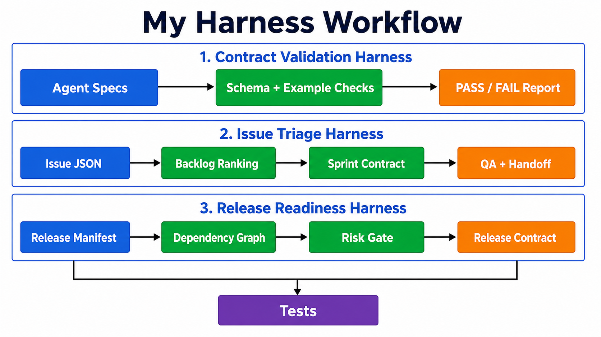
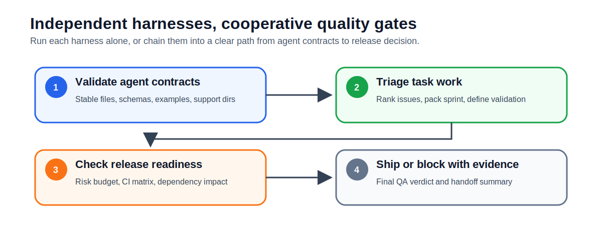
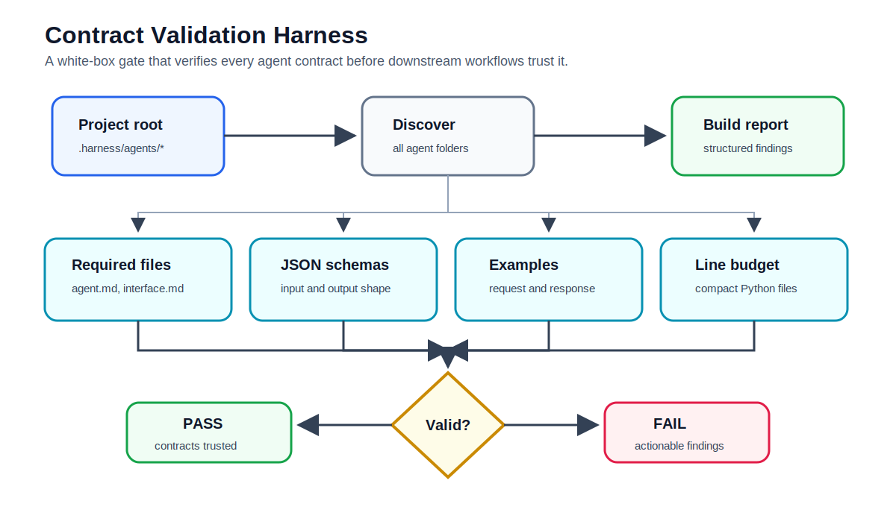
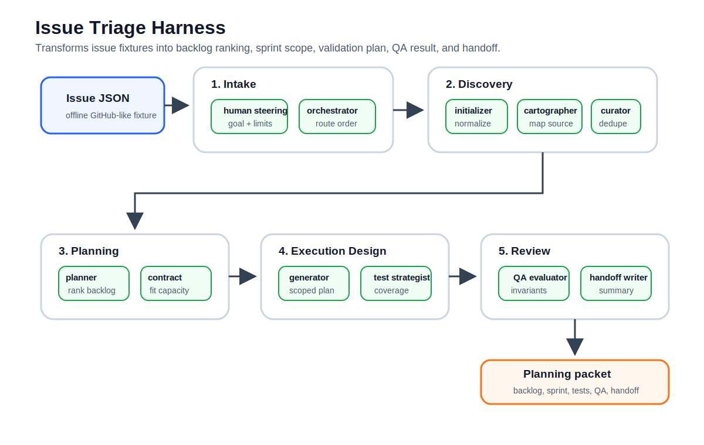
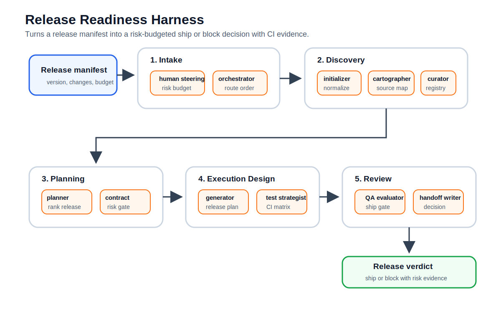

# My Harness Workflow

**Language:** English | [中文](README.zh-CN.md)

This is a contract-driven agent harness workspace. It currently includes three executable harnesses:

- Contract Validation Harness: validates `.harness/agents/*` contracts, schemas, examples, and code line budgets.
- Issue Triage Harness: runs a full 11-agent issue triage, sprint planning, QA, and handoff workflow from an offline GitHub-like fixture.
- Release Readiness Harness: models release engineering for a FastAPI-inspired Python API framework, including dependencies, CI matrix, risk gates, validation strategy, and handoff.

The design is intentionally compact: split agent work into verifiable contracts, explicit state, reproducible inputs, machine-checkable outputs, and end-to-end tests. Runtime code has no third-party dependency, and the self-check enforces a 300-line budget for Python code files.

## Quick Start

```powershell
python -m harness .
python -m harness . --json
python -m harness issue-triage examples\issue_triage\issues.json --capacity 13
python -m harness release-readiness examples\release_readiness\manifest.json --risk-budget 72
python -m unittest discover -s tests -v
```

## Architecture



## Independent or Cooperative

Each harness can run independently, and the three harnesses can also be combined as a release-quality workflow.

| Mode | How it works |
| --- | --- |
| Independent | Run `python -m harness .`, `issue-triage`, or `release-readiness` directly against its own input. |
| Cooperative | Run contract validation first, then use the executable harnesses as task-level and release-level gates. |
| Shared foundation | All executable harnesses share the same 11-agent pipeline and common input/status helpers. |

Independence matters when you only need one check: contract validation for agent spec hygiene, issue triage for planning, or release readiness for shipment. Cooperation matters when you want a full path from agent contract quality to task selection to release decision. The harnesses are not tightly coupled by hidden global state; they cooperate through explicit artifacts and repeated QA gates.

Typical cooperative order:



## Existing Agents

| Agent | Role |
| --- | --- |
| `human_steering` | Captures goals, constraints, approvals, risks, and stop conditions. |
| `harness_orchestrator` | Routes the workflow, enforces phase order, and blocks unsafe progress. |
| `initializer_agent` | Initializes or normalizes task input into a stable working shape. |
| `repo_cartographer` | Maps the repository or fixture source so later stages know what exists. |
| `product_planner` | Converts inputs into prioritized product/backlog decisions. |
| `sprint_contract_agent` | Creates bounded sprint contracts with acceptance criteria and capacity. |
| `implementation_generator` | Produces scoped implementation plans or change records. |
| `qa_evaluator` | Independently checks acceptance criteria, validation results, and risks. |
| `handoff_writer` | Produces handoff summaries and next-step records. |
| `feature_registry_curator` | Maintains stable feature records and duplicate/status reconciliation. |
| `test_strategist` | Plans validation commands, coverage, and regression strategy. |

## Harness Architectures

Each harness is intentionally small, explicit, and testable. The sections below show the boundary, entrypoint, files, agent coverage, and execution flow for each architecture.

---

## Harness Architecture 01 - Contract Validation Harness

**Detailed README:** [harness/README.md](harness/README.md)

**Purpose:** validate the control-plane contracts that define the available agents.

**What it does:** this harness is the safety gate for the agent control plane. It checks whether every agent exposes the same minimum contract: human-readable spec, interface document, JSON schemas, examples, and support directory. Run it alone before adding or changing agents; in a cooperative workflow, run it first so task and release harnesses can trust the agent surface.

It is intentionally strict and mechanical. The goal is not to judge agent creativity; the goal is to make sure every agent is callable, inspectable, testable, and documented in a consistent way. A failing result means the harness ecosystem itself is not reliable enough for downstream task execution.

**Use it when:** adding agents, changing schemas, reviewing support files, or checking that Python files still respect the project line-budget discipline.

**Entrypoint:**

```powershell
python -m harness .
python -m harness . --json
```

**At a glance:**

| Aspect | Design |
| --- | --- |
| Input | `.harness/agents/*` contract directories |
| Output | `PASS/FAIL` report with structured findings |
| Scope | Agent specs, JSON schemas, examples, interface shape, Python line budget |
| Runtime dependency | Python standard library only |
| Failure mode | Non-zero exit code when any error-level finding exists |

**Core files:**

| File | Purpose |
| --- | --- |
| [harness/common.py](harness/common.py) | Shared agent pipeline, JSON loading, input validation, status rendering, and common guard helpers. |
| [harness/core.py](harness/core.py) | Discovers agents, validates required files, checks JSON schemas/examples, and enforces Python line budget. |
| [harness/__main__.py](harness/__main__.py) | CLI entrypoint for contract validation and executable sample harnesses. |
| [harness/__init__.py](harness/__init__.py) | Public Python API exports. |
| [tests/test_harness.py](tests/test_harness.py) | Regression tests for schema validation, agent checks, CLI JSON, and line-budget enforcement. |

**Agents used:** every agent under `.harness/agents/*` is discovered and validated; this harness verifies contracts rather than executing behavior.

**Agent contract validation flow:**



---

## Harness Architecture 02 - Issue Triage Harness

**Detailed README:** [examples/issue_triage/README.md](examples/issue_triage/README.md)

**Purpose:** run a realistic but compact GitHub issue triage workflow from offline fixture data.

**What it does:** this harness converts issue-like work into an executable planning packet. It normalizes raw tickets, links duplicates and dependencies, ranks work, fits a sprint within capacity, defines validation, and produces a QA-checked handoff. Run it alone for backlog grooming; in a cooperative workflow, run it after contract validation and before release readiness.

The architecture models a practical product-engineering loop: user intent is captured first, the fixture is mapped, issue records are curated, planning chooses the highest-value work, and QA checks that the selected sprint is coherent. This makes the harness useful for many GitHub-style maintenance tasks without depending on live network access.

**Use it when:** ranking issues, preparing a sprint, detecting duplicate tickets, generating acceptance criteria, or producing a handoff that another agent or developer can execute.

**Entrypoint:**

```powershell
python -m harness issue-triage examples\issue_triage\issues.json --capacity 13
python -m harness issue-triage examples\issue_triage\issues.json --capacity 13 --json
```

**At a glance:**

| Aspect | Design |
| --- | --- |
| Input | Offline GitHub-like issue/PR JSON fixture |
| Output | Backlog, related groups, sprint contract, test strategy, QA, handoff |
| Scope | Full 11-agent workflow from steering to handoff |
| Runtime dependency | Python standard library only |
| Failure mode | Non-zero exit code when QA invariants fail |

**Core files:**

| File | Purpose |
| --- | --- |
| [harness/issue_triage.py](harness/issue_triage.py) | Normalizes issues, detects related issues, ranks backlog, packs sprint capacity, creates QA and handoff output. |
| [examples/issue_triage/issues.json](examples/issue_triage/issues.json) | Offline GitHub-like issue/PR fixture. |
| [examples/issue_triage/README.md](examples/issue_triage/README.md) | Detailed guide for the issue triage harness. |
| [tests/test_issue_triage.py](tests/test_issue_triage.py) | End-to-end tests for all-agent execution, scoring, duplicate detection, capacity, CLI JSON, and invalid input. |

**Agents used by phase:**

| Phase | Agents | Responsibility |
| --- | --- | --- |
| Intake | `human_steering`<br>`harness_orchestrator` | Capture the triage goal and route the workflow. |
| Discovery | `initializer_agent`<br>`repo_cartographer`<br>`feature_registry_curator` | Normalize tickets, map the fixture, and reconcile related work. |
| Planning | `product_planner`<br>`sprint_contract_agent` | Rank backlog items and fit the sprint to capacity. |
| Execution design | `implementation_generator`<br>`test_strategist` | Produce implementation scope and validation coverage. |
| Review | `qa_evaluator`<br>`handoff_writer` | Check invariants and produce the final handoff. |

**Architecture flow:**



---

## Harness Architecture 03 - Release Readiness Harness

**Detailed README:** [examples/release_readiness/README.md](examples/release_readiness/README.md)

**Purpose:** evaluate whether a FastAPI-inspired Python API framework release is ready to ship under a defined risk budget.

**What it does:** this harness turns a release manifest into a release decision. It builds the dependency graph, records changed surfaces, scores risk against a budget, selects release actions, plans CI coverage, and blocks shipment when QA invariants fail. Run it alone as a release gate; in a cooperative workflow, run it after issue triage to check whether planned work is ready to ship.

The harness treats release readiness as a budgeted risk problem instead of a vague checklist. Each change contributes dependency and compatibility risk; the release contract decides what can ship now and what should be deferred. QA then verifies that included changes have matching test coverage and that the final decision is explainable.

**Use it when:** preparing a release, deciding whether to defer risky changes, checking CI matrix coverage, or creating a concise release handoff.

**Entrypoint:**

```powershell
python -m harness release-readiness examples\release_readiness\manifest.json --risk-budget 72
python -m harness release-readiness examples\release_readiness\manifest.json --risk-budget 72 --json
```

**At a glance:**

| Aspect | Design |
| --- | --- |
| Input | Offline release manifest inspired by FastAPI dependency and CI concerns |
| Output | Dependency graph, change registry, risk ledger, release contract, QA, handoff |
| Scope | Full 11-agent release workflow from steering to release handoff |
| Runtime dependency | Python standard library only |
| Failure mode | Non-zero exit code when release QA invariants fail |

**Core files:**

| File | Purpose |
| --- | --- |
| [harness/release_readiness.py](harness/release_readiness.py) | Normalizes release manifests, builds dependency graph, scores release risk, creates release contract, QA, and handoff. |
| [examples/release_readiness/manifest.json](examples/release_readiness/manifest.json) | Offline FastAPI-inspired release fixture. |
| [examples/release_readiness/README.md](examples/release_readiness/README.md) | Detailed guide for the release readiness harness. |
| [tests/test_release_readiness.py](tests/test_release_readiness.py) | Tests for agent coverage, dependency graph, risk budget, test matrix, CLI JSON, and invalid manifests. |

**Agents used by phase:**

| Phase | Agents | Responsibility |
| --- | --- | --- |
| Intake | `human_steering`<br>`harness_orchestrator` | Set the release boundary and route the workflow. |
| Discovery | `initializer_agent`<br>`repo_cartographer`<br>`feature_registry_curator` | Normalize the manifest, map source surfaces, and register changes. |
| Planning | `product_planner`<br>`sprint_contract_agent` | Rank release work and enforce the risk budget. |
| Execution design | `implementation_generator`<br>`test_strategist` | Produce release actions and CI/test coverage. |
| Review | `qa_evaluator`<br>`handoff_writer` | Gate shipment and write the final release decision. |

**Architecture flow:**



---

## Quality Gates

The current verification chain is:

```powershell
python -m unittest discover -s tests -v
python -m harness .
python -m harness issue-triage examples\issue_triage\issues.json --capacity 13
python -m harness release-readiness examples\release_readiness\manifest.json --risk-budget 72
python -m py_compile harness\__init__.py harness\__main__.py harness\common.py harness\core.py harness\issue_triage.py harness\release_readiness.py tests\test_harness.py tests\test_issue_triage.py tests\test_release_readiness.py
```

Expected results:

- 24 tests pass.
- `python -m harness .` returns `PASS: 11 agent(s) checked`.
- Issue triage returns `PASSED`, `agents: 11/11`, and a capacity-respecting sprint.
- Release readiness returns `PASSED`, `agents: 11/11`, and a risk-budget-respecting release contract.
