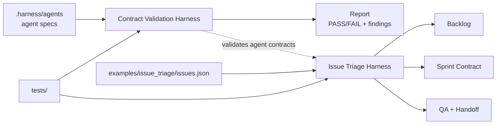

# My Harness Workflow

**语言:** [English](README.md) | 中文

这是一个契约驱动的 agent harness 工作区。它目前包含三个可执行 harness：

- Contract Validation Harness：校验 `.harness/agents/*` 的 agent 契约、schema、examples 和代码行数预算。
- Issue Triage Harness：基于离线 GitHub-like fixture 跑完整的 11-agent issue 分诊、sprint planning、QA 和 handoff 工作流。
- Release Readiness Harness：基于 FastAPI-inspired Python API framework 的 release engineering 场景，检查依赖、CI 矩阵、风险门禁、测试策略和交接。

设计目标是把 agent 工作拆成可验证契约、显式状态、可复现输入、机器可检查输出和端到端测试。运行时代码没有第三方依赖，并通过自检约束 Python 代码文件不超过 300 行。

## 快速开始

```powershell
python -m harness .
python -m harness . --json
python -m harness issue-triage examples\issue_triage\issues.json --capacity 13
python -m harness release-readiness examples\release_readiness\manifest.json --risk-budget 72
python -m unittest discover -s tests -v
```

## 架构



## 已有 Agents

| Agent | 角色 |
| --- | --- |
| `human_steering` | 捕获目标、约束、审批、风险和停止条件。 |
| `harness_orchestrator` | 路由工作流、约束阶段顺序，并阻止不安全推进。 |
| `initializer_agent` | 初始化或标准化任务输入。 |
| `repo_cartographer` | 映射仓库或 fixture 来源。 |
| `product_planner` | 将输入转成优先级明确的产品/backlog 决策。 |
| `sprint_contract_agent` | 创建有容量边界、验收标准清晰的 sprint contract。 |
| `implementation_generator` | 生成范围明确的实现计划或变更记录。 |
| `qa_evaluator` | 独立检查验收标准、验证结果和风险。 |
| `handoff_writer` | 生成交接摘要和下一步记录。 |
| `feature_registry_curator` | 维护稳定 feature 记录，并处理重复/状态协调。 |
| `test_strategist` | 规划验证命令、覆盖范围和回归测试策略。 |

## Harnesses

### Contract Validation Harness

详细说明：[harness/README.zh-CN.md](harness/README.zh-CN.md)

用途：校验定义可用 agents 的控制平面契约。

文件：

| 文件 | 用途 |
| --- | --- |
| [harness/core.py](harness/core.py) | 发现 agents，校验必需文件、JSON schemas/examples，并执行代码行数预算检查。 |
| [harness/__main__.py](harness/__main__.py) | Contract validation 和 issue triage 的 CLI 入口。 |
| [harness/__init__.py](harness/__init__.py) | 对外 Python API exports。 |
| [tests/test_harness.py](tests/test_harness.py) | schema、agent 检查、CLI JSON 和行数预算的回归测试。 |

使用的 agents：

- 会发现并校验 `.harness/agents/*` 下的所有 agents。
- 不执行 agent 行为，只校验契约和 examples。

### Issue Triage Harness

详细说明：[examples/issue_triage/README.zh-CN.md](examples/issue_triage/README.zh-CN.md)

用途：基于离线 fixture 跑一个真实但紧凑的 GitHub issue triage 工作流。

文件：

| 文件 | 用途 |
| --- | --- |
| [harness/issue_triage.py](harness/issue_triage.py) | 标准化 issues、检测相关项、排序 backlog、打包 sprint、生成 QA 和 handoff 输出。 |
| [examples/issue_triage/issues.json](examples/issue_triage/issues.json) | 离线 GitHub-like issue/PR fixture。 |
| [examples/issue_triage/README.zh-CN.md](examples/issue_triage/README.zh-CN.md) | Issue triage harness 详细中文说明。 |
| [tests/test_issue_triage.py](tests/test_issue_triage.py) | 全 agent 执行、优先级、重复检测、容量、CLI JSON 和非法输入的端到端测试。 |

使用的 agents：

1. `human_steering`
2. `harness_orchestrator`
3. `initializer_agent`
4. `repo_cartographer`
5. `feature_registry_curator`
6. `product_planner`
7. `sprint_contract_agent`
8. `implementation_generator`
9. `test_strategist`
10. `qa_evaluator`
11. `handoff_writer`

### Release Readiness Harness

详细说明：[examples/release_readiness/README.zh-CN.md](examples/release_readiness/README.zh-CN.md)

用途：评估一个 FastAPI-inspired Python API framework release 是否能在风险预算内发布。

文件：

| 文件 | 用途 |
| --- | --- |
| [harness/release_readiness.py](harness/release_readiness.py) | 标准化 release manifest、构建 dependency graph、计算 release risk、生成 release contract、QA 和 handoff。 |
| [examples/release_readiness/manifest.json](examples/release_readiness/manifest.json) | 离线 FastAPI-inspired release fixture。 |
| [examples/release_readiness/README.zh-CN.md](examples/release_readiness/README.zh-CN.md) | Release readiness harness 中文说明。 |
| [tests/test_release_readiness.py](tests/test_release_readiness.py) | agent 覆盖、依赖图、风险预算、测试矩阵、CLI JSON 和非法 manifest 的测试。 |

使用的 agents：

1. `human_steering`
2. `harness_orchestrator`
3. `initializer_agent`
4. `repo_cartographer`
5. `feature_registry_curator`
6. `product_planner`
7. `sprint_contract_agent`
8. `implementation_generator`
9. `test_strategist`
10. `qa_evaluator`
11. `handoff_writer`

## 质量门禁

```powershell
python -m unittest discover -s tests -v
python -m harness .
python -m harness issue-triage examples\issue_triage\issues.json --capacity 13
python -m harness release-readiness examples\release_readiness\manifest.json --risk-budget 72
python -m py_compile harness\__init__.py harness\__main__.py harness\core.py harness\issue_triage.py harness\release_readiness.py tests\test_harness.py tests\test_issue_triage.py tests\test_release_readiness.py
```

期望结果：

- 22 个测试通过。
- `python -m harness .` 返回 `PASS: 11 agent(s) checked`。
- Issue triage 返回 `PASSED`、`agents: 11/11`，且 sprint 不超过容量。
- Release readiness 返回 `PASSED`、`agents: 11/11`，且 release contract 不超过风险预算。
