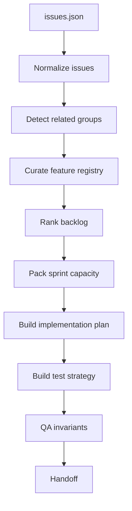

# Issue Triage Harness

**Language:** English | [中文](README.zh-CN.md)

This fixture mirrors the public shape of Hugging Face GitHub issue datasets such
as `abhishek-shrm/github-issues`: GitHub-like rows with title, labels, state,
comments, reactions, timestamps, body, and pull request markers. The data here is
intentionally small and offline so tests never need network access.

## Purpose

This harness demonstrates a full long-running-agent workflow on a compact task:
turn a mixed GitHub issue/PR fixture into triage outcomes, feature records, a
prioritized backlog, a capacity-bound sprint, an implementation plan, a test
strategy, QA checks, and a handoff summary.

## Files

| File | Responsibility |
| --- | --- |
| `issues.json` | Offline issue/PR fixture used by tests and CLI demos. |
| `README.md` | This detailed harness guide. |
| `../../harness/issue_triage.py` | Workflow implementation. |
| `../../tests/test_issue_triage.py` | Regression tests for this harness. |

## Run

```powershell
python -m harness issue-triage examples\issue_triage\issues.json --capacity 13
python -m harness issue-triage examples\issue_triage\issues.json --capacity 13 --json
```

Expected text output:

```text
PASSED: issue triage workflow completed
- agents: 11/11
- backlog: 8 open issue(s)
- sprint: 4 item(s), 11/13 points
```

## Agents Used

This harness intentionally uses all existing agents:

1. `human_steering` captures the task contract.
2. `harness_orchestrator` fixes the stage order.
3. `initializer_agent` normalizes the issue set.
4. `repo_cartographer` maps the fixture source.
5. `feature_registry_curator` creates stable feature records.
6. `product_planner` scores and orders the backlog.
7. `sprint_contract_agent` packs work within capacity.
8. `implementation_generator` creates scoped implementation entries.
9. `test_strategist` creates the validation matrix.
10. `qa_evaluator` checks invariants.
11. `handoff_writer` summarizes the result.

## Flow



## Output Shape

The JSON report contains:

- `source`: fixture path, issue count, and sprint capacity.
- `agents_run`: the complete 11-agent execution order.
- `repo_map`: fixture-level source map.
- `feature_registry`: stable feature records for non-PR issues.
- `backlog`: open, non-PR issues ranked by priority and score.
- `related_groups`: duplicate or closely related issue groups.
- `sprint_contract`: selected sprint items, used capacity, and deferred work.
- `triage_outcomes`: one outcome for every raw issue/PR.
- `implementation_plan`: scoped change plan for selected sprint items.
- `test_strategy`: validation matrix and local commands.
- `qa`: invariant checks.
- `handoff`: summary and next agent.

## QA Invariants

The harness passes only when:

- All 11 agents are present in the expected order.
- Sprint capacity is not exceeded.
- Backlog issue numbers are unique.
- Every sprint item has acceptance criteria.
- Feature registry coverage is complete for relevant backlog items.
- Every raw input row receives a triage outcome.

## Tests

```powershell
python -m unittest tests.test_issue_triage -v
```

Covered behavior:

- all-agent workflow execution
- bug/security-relevant priority ranking
- related issue deferral
- capacity-respecting sprint selection
- closed issue and PR exclusion from backlog
- CLI JSON output
- empty input and zero-capacity stability
- readable invalid-input errors
