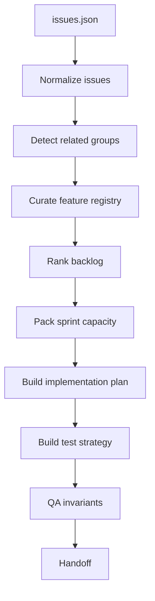

# Issue Triage Harness

**语言:** [English](README.md) | 中文

这个 fixture 模拟 Hugging Face GitHub issue 数据集的公开形态，例如 `abhishek-shrm/github-issues`：每行包含 title、labels、state、comments、reactions、timestamps、body 和 pull request 标记。这里的数据刻意保持小型且离线，因此测试不需要网络访问。

## 用途

这个 harness 展示一个完整的长任务 agent 工作流：把混合 issue/PR fixture 转换成 triage outcomes、feature records、优先级 backlog、容量受限 sprint、实现计划、测试策略、QA 检查和 handoff summary。

## 文件

| 文件 | 责任 |
| --- | --- |
| `issues.json` | 测试和 CLI demo 使用的离线 issue/PR fixture。 |
| `README.md` | 英文详细说明。 |
| `README.zh-CN.md` | 中文详细说明。 |
| `../../harness/issue_triage.py` | 工作流实现。 |
| `../../tests/test_issue_triage.py` | 这个 harness 的回归测试。 |

## 运行

```powershell
python -m harness issue-triage examples\issue_triage\issues.json --capacity 13
python -m harness issue-triage examples\issue_triage\issues.json --capacity 13 --json
```

期望文本输出：

```text
PASSED: issue triage workflow completed
- agents: 11/11
- backlog: 8 open issue(s)
- sprint: 4 item(s), 11/13 points
```

## 使用的 Agents

这个 harness 刻意使用所有已有 agents：

1. `human_steering` 捕获任务契约。
2. `harness_orchestrator` 固定阶段顺序。
3. `initializer_agent` 标准化 issue 集合。
4. `repo_cartographer` 映射 fixture 来源。
5. `feature_registry_curator` 创建稳定 feature records。
6. `product_planner` 打分并排序 backlog。
7. `sprint_contract_agent` 在容量内打包工作。
8. `implementation_generator` 创建范围明确的实现计划。
9. `test_strategist` 创建验证矩阵。
10. `qa_evaluator` 检查 invariants。
11. `handoff_writer` 总结结果。

## 流程



## 输出结构

JSON report 包含：

- `source`：fixture 路径、issue 数量和 sprint 容量。
- `agents_run`：完整 11-agent 执行顺序。
- `repo_map`：fixture-level source map。
- `feature_registry`：非 PR issue 的稳定 feature records。
- `backlog`：按 priority 和 score 排序的 open non-PR issues。
- `related_groups`：重复或强相关 issue groups。
- `sprint_contract`：选中的 sprint items、已用容量和 deferred work。
- `triage_outcomes`：每条原始 issue/PR 的 outcome。
- `implementation_plan`：选中 sprint items 的 scoped change plan。
- `test_strategy`：验证矩阵和本地 commands。
- `qa`：invariant checks。
- `handoff`：summary 和 next agent。

## QA Invariants

harness 只有在以下条件全部满足时才通过：

- 11 个 agents 都按预期顺序出现。
- Sprint capacity 没有超出。
- Backlog issue numbers 唯一。
- 每个 sprint item 都有 acceptance criteria。
- Feature registry 覆盖相关 backlog items。
- 每条原始输入都有 triage outcome。

## 测试

```powershell
python -m unittest tests.test_issue_triage -v
```

覆盖行为：

- all-agent workflow execution
- bug/security-relevant priority ranking
- related issue deferral
- capacity-respecting sprint selection
- closed issue and PR exclusion from backlog
- CLI JSON output
- empty input and zero-capacity stability
- readable invalid-input errors
