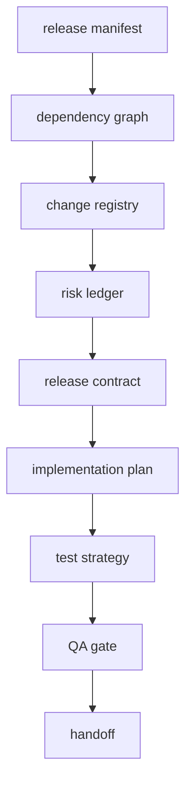

# Release Readiness Harness

**Language:** English | [中文](README.zh-CN.md)

This harness models a release engineering workflow inspired by the public
[FastAPI](https://github.com/fastapi/fastapi) project. FastAPI is a production
Python API framework built on Starlette and Pydantic, which makes it a useful
sample for dependency, CI, compatibility, documentation, and release-gate checks.

## Purpose

The harness turns an offline release manifest into a release readiness report:
dependency graph, change registry, release backlog, risk ledger, release
contract, implementation plan, test strategy, QA result, and handoff summary.

## Run

```powershell
python -m harness release-readiness examples\release_readiness\manifest.json --risk-budget 72
python -m harness release-readiness examples\release_readiness\manifest.json --risk-budget 72 --json
```

Expected text output:

```text
PASSED: release readiness workflow completed
- agents: 11/11
- project: fastapi-inspired-api-framework 0.116.0
- changes: 3 included, 1 deferred
- risk: 68/72
```

## Agents Used

1. `human_steering` defines the release boundary and risk budget.
2. `harness_orchestrator` fixes the stage order.
3. `initializer_agent` validates and normalizes the manifest.
4. `repo_cartographer` maps the fixture and source project.
5. `feature_registry_curator` creates the change registry.
6. `product_planner` ranks release changes by risk and blocker status.
7. `sprint_contract_agent` builds the release contract.
8. `implementation_generator` creates scoped release actions.
9. `test_strategist` creates the validation matrix.
10. `qa_evaluator` checks release invariants.
11. `handoff_writer` summarizes readiness and next ownership.

## Flow



## QA Invariants

- all 11 agents are used
- release risk stays within budget
- no critical blockers remain
- included changes have acceptance criteria
- test strategy covers every included change
- CI matrix and Python versions are present

