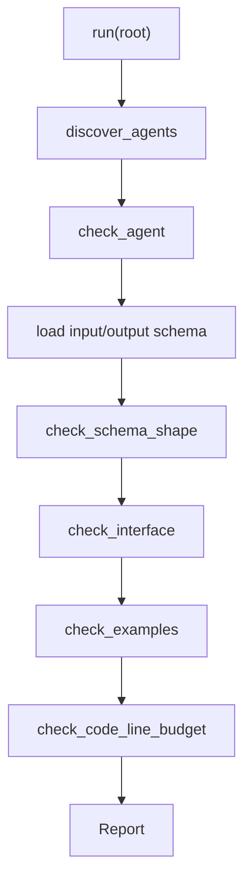

# Contract Validation Harness

**Language:** English | [中文](README.zh-CN.md)

This harness validates the agent control plane in `.harness/agents`. It is a small, zero-dependency Python checker that turns agent specifications into machine-checkable contracts.

## What It Checks

For each agent directory, the harness checks:

- Required files: `agent.md`, `interface.md`, `input.schema.json`, `output.schema.json`.
- Support directories: `examples/`, `policies/`, `templates/`, `checklists/`.
- Interface sections: `Purpose`, `Consumes`, `Produces`, and `Must Not Do`.
- JSON schema shape: object roots, valid `properties`, and required fields that actually exist.
- Example files: `*request*.json` must match input schema, `*output*.json` must match output schema.
- Python code line budget: code files must stay at or below 300 lines.

## Files

| File | Responsibility |
| --- | --- |
| [common.py](common.py) | Shared pipeline, JSON loading, input validation, status rendering, and guard helpers used by executable harnesses. |
| [core.py](core.py) | Core validator, report model, schema subset validator, example validation, and line-budget check. |
| [__main__.py](__main__.py) | CLI routing for contract validation and executable sample harnesses. |
| [__init__.py](__init__.py) | Public exports for tests and downstream callers. |

## Agents Used

This harness validates every existing agent contract:

- `feature_registry_curator`
- `handoff_writer`
- `harness_orchestrator`
- `human_steering`
- `implementation_generator`
- `initializer_agent`
- `product_planner`
- `qa_evaluator`
- `repo_cartographer`
- `sprint_contract_agent`
- `test_strategist`

It does not execute agent behavior. It checks that each agent has a coherent machine-readable contract and representative examples.

## Flow



## CLI

```powershell
python -m harness .
python -m harness . --json
```

Human-readable output:

```text
PASS: 11 agent(s) checked
```

JSON output includes:

- `root`
- `agents`
- `passed`
- `findings`

## Design Notes

The JSON schema validator intentionally implements only the local subset used by the agent contracts: `type`, `required`, `properties`, `additionalProperties`, `items`, `enum`, `minLength`, and local `$ref`. This keeps the harness compact while covering the actual contracts in this workspace.
