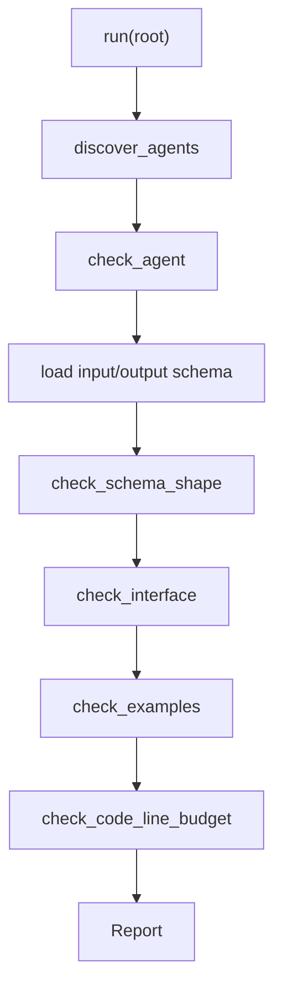

# Contract Validation Harness

**语言:** [English](README.md) | 中文

这个 harness 校验 `.harness/agents` 中的 agent 控制平面。它是一个小型、零第三方依赖的 Python 检查器，用于把 agent 规格变成机器可检查的契约。

## 检查内容

对每个 agent 目录，harness 会检查：

- 必需文件：`agent.md`、`interface.md`、`input.schema.json`、`output.schema.json`。
- 支持目录：`examples/`、`policies/`、`templates/`、`checklists/`。
- Interface sections：`Purpose`、`Consumes`、`Produces`、`Must Not Do`。
- JSON schema 形态：根对象、有效 `properties`、`required` 字段必须真实存在。
- Example 文件：`*request*.json` 必须匹配 input schema，`*output*.json` 必须匹配 output schema。
- Python 代码行数预算：代码文件必须小于等于 300 行。

## 文件

| 文件 | 责任 |
| --- | --- |
| [common.py](common.py) | 可执行 harness 共享的 pipeline、JSON 加载、输入校验、状态渲染和 guard helpers。 |
| [core.py](core.py) | 核心校验器、report model、schema 子集校验、example 校验和行数预算检查。 |
| [__main__.py](__main__.py) | Contract validation 和可执行样例 harness 的 CLI 路由。 |
| [__init__.py](__init__.py) | 对测试和下游调用方暴露的 public exports。 |

## 使用的 Agents

这个 harness 会校验所有已有 agent 契约：

- `feature_registry_curator`
- `handoff_writer`
- `harness_orchestrator`
- `human_steering`
- `implementation_generator`
- `initializer_agent`
- `product_planner`
- `qa_evaluator`
- `repo_cartographer`
- `sprint_contract_agent`
- `test_strategist`

它不执行 agent 行为，只检查每个 agent 是否具有一致的机器可读契约和代表性 examples。

## 流程



## CLI

```powershell
python -m harness .
python -m harness . --json
```

人类可读输出：

```text
PASS: 11 agent(s) checked
```

JSON 输出包含：

- `root`
- `agents`
- `passed`
- `findings`

## 设计说明

JSON schema validator 只实现当前 agent contracts 实际使用的本地子集：`type`、`required`、`properties`、`additionalProperties`、`items`、`enum`、`minLength` 和本地 `$ref`。这样可以保持实现紧凑，同时覆盖当前工作区里的真实契约。
